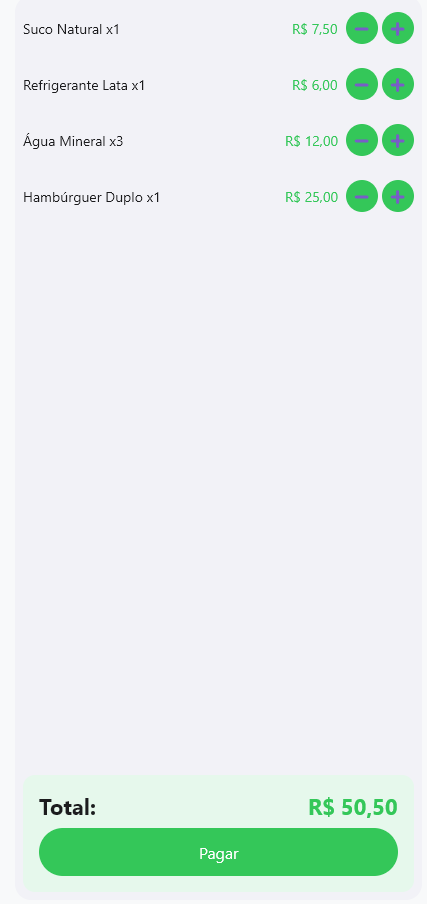
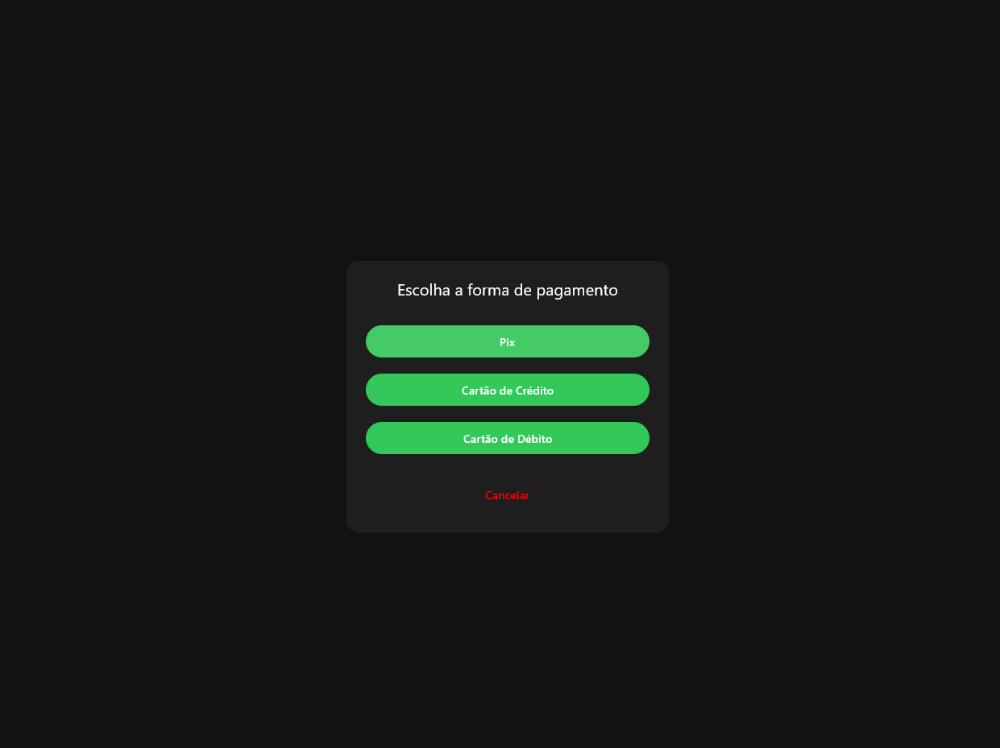
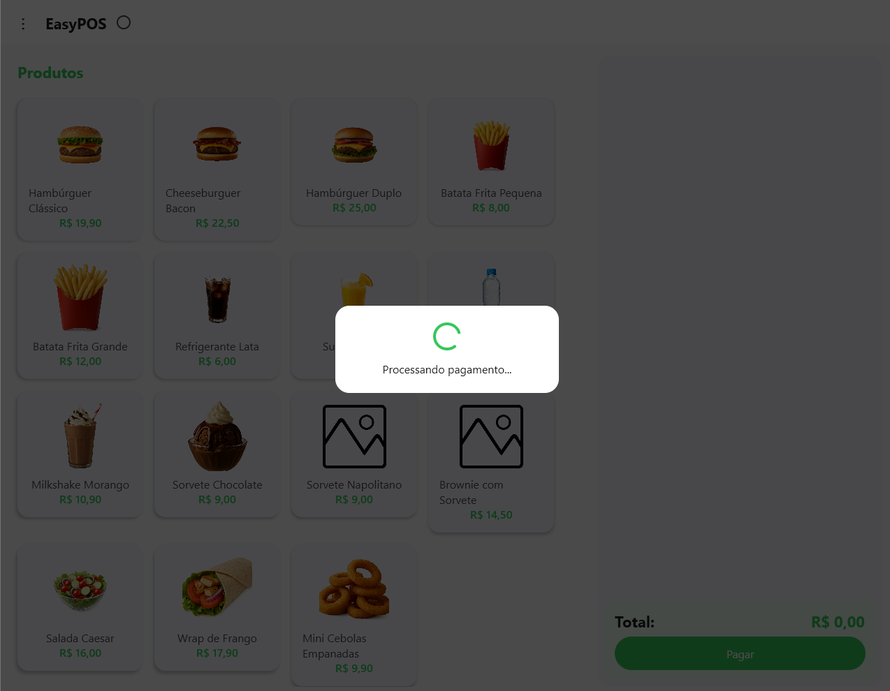
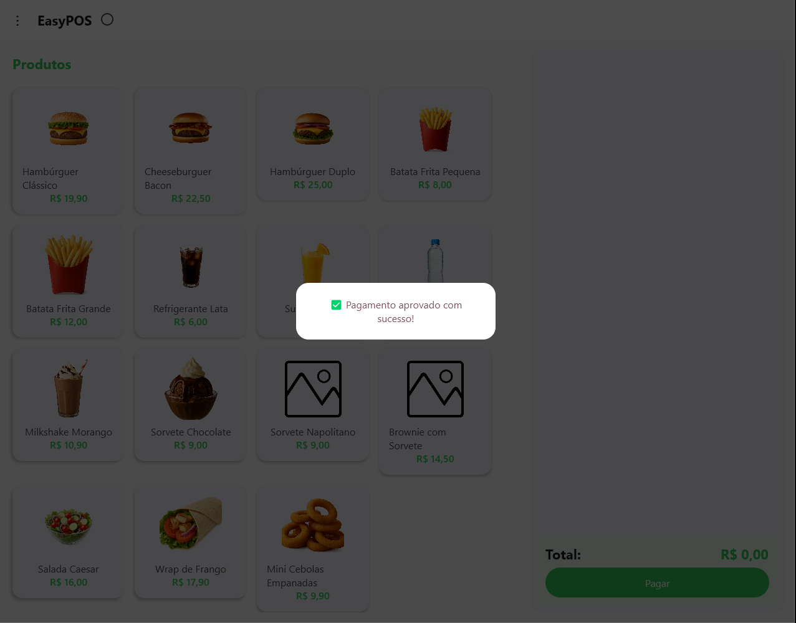
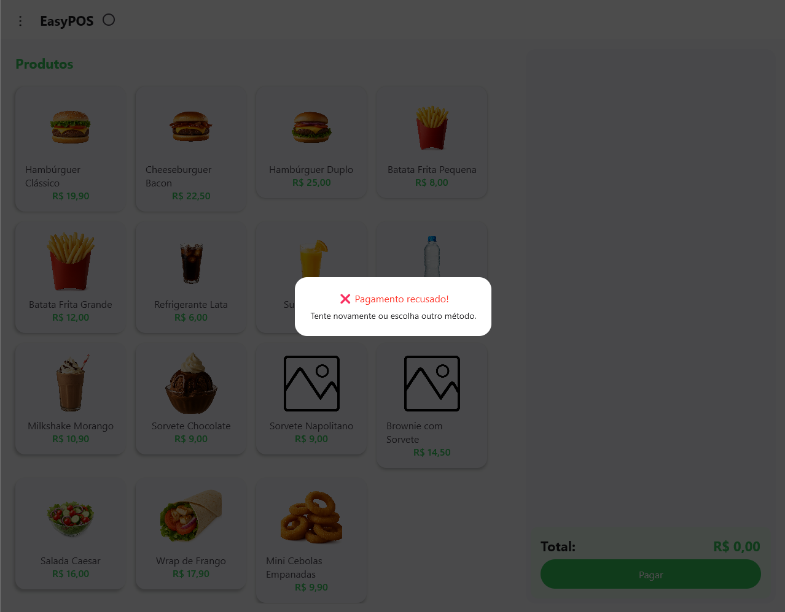
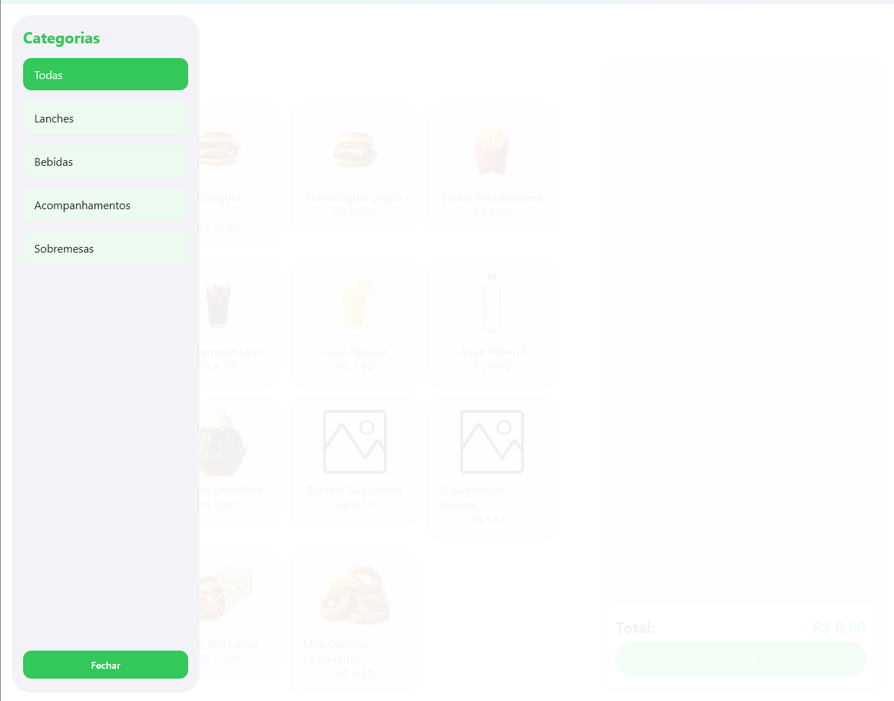

🍔 EasyPOS – Sistema de Autoatendimento Touchscreen
O EasyPOS é um sistema de Ponto de Venda (PDV) touchscreen desenvolvido com Kotlin Multiplatform e Jetpack Compose, pensado para oferecer uma experiência de autoatendimento moderna e eficiente em lanchonetes, cafeterias, padarias, food trucks e outros estabelecimentos de alimentação rápida.

Com uma interface fluida, responsiva e otimizada para telas sensíveis ao toque, o EasyPOS proporciona uma jornada de compra simples e intuitiva, tanto para o cliente quanto para quem administra.

✨ Principais Funcionalidades
✅ Interface 100% touch, fluída e moderna

📦 Produtos exibidos por categorias (lanches, bebidas, sobremesas...)

🛒 Carrinho dinâmico com agrupamento de itens e controle de quantidades

💳 Simulação de pagamentos via Pix, cartão de crédito e débito

🖼️ Tela de splash animada com banners promocionais

📄 Histórico de vendas salvo localmente em .json

📱 Layout responsivo e visual inspirado em terminais de autoatendimento

⚙️ Tecnologias Utilizadas
Kotlin Multiplatform – Código compartilhado para Desktop e Android

Jetpack Compose Multiplatform – UI moderna e reativa

Compose Material 3 – Componentes visuais atualizados

Kotlinx Serialization – Persistência de dados local em JSON

Armazenamento local via arquivos .json – Sem necessidade de banco de dados externo

🚀 Como Rodar o Projeto
Pré-requisitos
IntelliJ IDEA Community Edition

JDK 17 ou superior

Gradle 8+ (já configurado no projeto)

Passo a Passo
Clone o repositório:

bash
Copiar
Editar
git clone (irei colocar meu link dps)
cd EasyPOS
Abra o projeto no IntelliJ IDEA, aguarde a sincronização do Gradle e execute a função main() do módulo composeApp.

⚠️ Por enquanto, o foco está na versão Desktop. Suporte para Android será adicionado em breve.

## 🖼️ Capturas de Tela

### Tela Inicial

### Carrinho de Compras

### Formas de Pagamento

### Processando Pagamento

### Pagamento Aprovado

### Pagamento Recusado

### Categorias

### Banner Promocional

---

Desenvolvido por Gabriel com 💚 em Kotlin.
